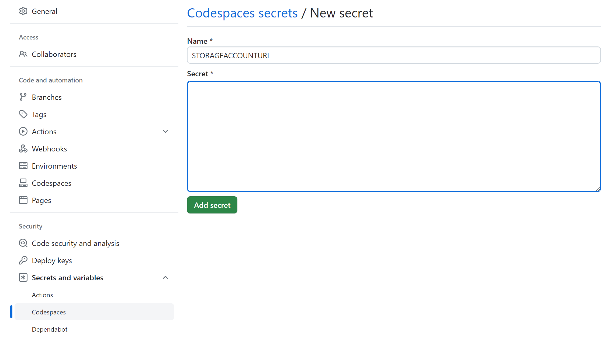
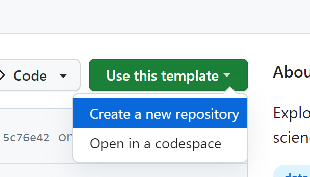

# Data Science with GitHub Codespaces

This workshop walks through getting started with setting up a Data Science Environment in GitHub Codespaces.

Make sure you have a:

* [GitHub Account](https://github.com/signup)
* [Sign up for Azure for Students](https://aka.ms/azure4students) and get $100 of credit with an .edu account.

**Agenda:**

1. Customizing a Codespace
2. Azure cli in a Codespace
3. Codespaces from a template
4. Create a Codespace from scratch

## Setup

1. Fork this repository
2. In the main page of the repository, under the repository name, use the Code drop-down menu, and in the Codespaces tab, select "Create codespace on main".

3. Wait as GitHub initializes the Codespace:

## Inspect your Codespace environment

What you have at this point is a pre-configured environment where all the runtimes and libraries you need are already installed - a zero config experience.

You also have a Jupyter Notebook that you can start using without any configuration.

> This environment will run the same regardless of whether you are on Windows, macOS or Linux.

Open up your Jupyter Notebook file [notebook.ipynb](notebook.ipynb) and follow instructions in the notebook.

## Customize your Codespace

* **Change the Python Version**: In [`devcontainer.json`](../.devcontainer/devcontainer.json), change the Python version in the `VARIANT` value.

* **Add extensions** In [`devcontainer.json`](../.devcontainer/devcontainer.json), add another extension in `extensions` properties.

**Try one of these extensions**:

* `Iterative.dvc` - track your ML experiments ([learn more](https://marketplace.visualstudio.com/items?itemName=Iterative.dvc))
* `ms-toolsai.jupyter-renderers` - output renderer for Jupyter Notebooks ([learn more](https://marketplace.visualstudio.com/items?itemName=ms-toolsai.jupyter-renderers&ssr=false#overview))
* `ms-toolsai.jupyter` - Jupyter Extension for Visual Studio Code ([learn more](https://marketplace.visualstudio.com/items?itemName=ms-toolsai.jupyter))
* `REditorSupport.r` - R extension for Visual Studio Code ([learn more](https://marketplace.visualstudio.com/items?itemName=REditorSupport.r))

## Codespace with Azure

In [notebook-azure.ipynb](notebook-azure.ipynb), we revisit the pumpkin dataset with logistic regression. This time, we'll be loading our cleaned dataset in Azure.
After `US-pumpkins-clean.csv` is created, it'll be uploaded to a Azure Storage account with the Azure cli. 

### Setup, after 

After `US-pumpkins-clean.csv` is created, follow the instructions below:

The [script](create-blob.sh) will:
- Create a resource group named `codespace-workshop-rg-#####`
- Create a storage account named `csblobstg#####`
- Create a blob container named `data` (_note: containers in this context are like "folders"_ )
- Upload the `US-pumpkins-clean.csv` file to the data container

It will output the name of your storage 

1. In the terminal (make sure you're in your virtual environment) run the following:
`az login --use-device-code`

2. Follow the authentication instructions

3. Return to the terminal and run: 
`chmod +x ./data-science-codespaces/create-blob.sh`

4. Run the follwing script:
`./data-science-codespaces/create-blob.sh`

5. If prompted to install the storage-preview cli extension, select `yes`

6. From the terminal, get the STORAGEACCOUNTURL and STORAGEACCOUNTKEY output values and set them in your codespaces secrets by going to your repo `settings > secrets and variables > codespaces > new repository secret`

7. Your codespace will reload with these secrets as environment variables.

## Make your own codespace from a template

1. Visit template repo: [Jupyter Notebook Template](https://github.com/github/codespaces-jupyter)

2. Open template in a Codespace:

3. Make some changes, try changing any of the notebooks or updating `devcontainer.json`

4. Publish your codespace to a private or public repository.

## Make your own Codespace from scratch

1. Create a repo, or use an existing repo that doesn't have a `.devcontainer` folder
2. Open the Command Palette with:
     * `Control + Shift + P` or 
     * From the menu in the top right corner select: `View > Command Palette`
3. In the Command Palette search for `Add Dev Container Configuration Files > Create a new configuration`
4. Select a configuration from the list, [full list here](https://containers.dev/templates)
5. Select features, for example, you can install the GitHub CLI, Conda, Python, R, or Nvidia CUDA (_only works on host machines with NVIDA GPU_)
6. (Optional) Customize your features
7. `.devcontainer/devcontainer.json` file will be created.

## Cleanup

In the Azure Portal, delete the Azure Storage Account you created.